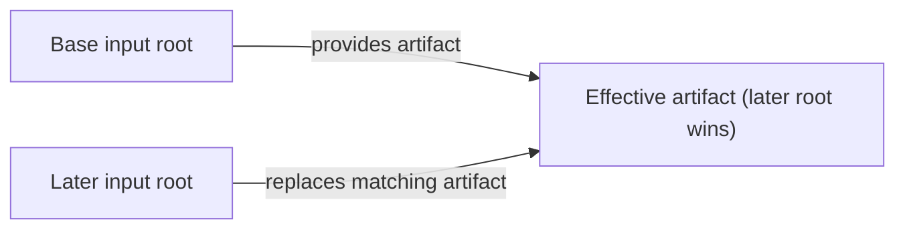

# Separate Input Roots

By default, `carabiner generate` reads source files from `<cwd>/.carabiner/` and writes generated tool configuration files to the output roots. Use `--input-roots <paths...>` to read source files from one or more other directories without changing where the output is written.

## Source trees and paths

Each `--input-roots` value is a Carabiner source tree. It directly contains source directories such as `rules/`, `commands/`, `subagents/`, `checks/`, and `skills/`, plus files such as `mcp.jsonc`, `hooks.jsonc`, and `permissions.jsonc`. Carabiner does not append `.carabiner/` to an input-root value.

```bash
# Read from ~/.aiglobal/.carabiner/rules/, ~/.aiglobal/.carabiner/skills/, and related files.
carabiner generate --input-roots ~/.aiglobal/.carabiner --targets "*" --features rules
```

Relative input-root paths are resolved from the current working directory. Absolute paths must already be normalized. An input root must be nonempty and cannot contain control characters or a `..` path segment. Duplicate resolved paths are used once.

The first input root is the required base. It must exist and be a directory, although it may be empty. Later input roots are optional overlays and may be absent. An overlay that exists must be a directory.

## Command scope

`--input-roots` and the legacy `--input-root` option are available only on `carabiner generate`. Commands such as `import`, `convert`, `gitignore`, `install`, `fetch`, and `init` do not accept these options. Run those commands from the directory that gives them their normal `.carabiner/` project context.

## Use one shared source tree

You can keep a source tree outside each project and generate from it while remaining in the project directory.

1. Create the shared project and initialize its source tree.

   ```bash
   mkdir -p ~/.aiglobal
   cd ~/.aiglobal
   carabiner init
   ```

2. Edit files such as `~/.aiglobal/.carabiner/rules/overview.md` and `~/.aiglobal/.carabiner/skills/<skill>/SKILL.md`.

3. From a project that should receive the generated files, run:

   ```bash
   carabiner generate --input-roots ~/.aiglobal/.carabiner --targets claudecode --features rules
   ```

Without an explicit output option or `--global`, generated files go to the current project rather than `~/.aiglobal`.

## Combine source trees

List input roots from the base to the most specific overlay. Later roots take precedence when they provide the same artifact.



```bash
carabiner generate --input-roots ./.carabiner ./.carabiner.local --targets "*" --features rules,mcp
```

In this example, files that exist only in `./.carabiner/` remain in use. A matching artifact in `./.carabiner.local/` replaces the version from the shared tree. For example, `./.carabiner.local/rules/coding-style.md` replaces `./.carabiner/rules/coding-style.md` for that developer.

`carabiner gitignore` adds `.carabiner.local/` to the generated ignore entries. If you use another overlay directory, add it to `.gitignore` yourself. This is useful when an overlay contains local credentials or permission settings.

You can also layer a repository-specific tree on a shared tree:

```bash
carabiner generate --input-roots ~/.aiglobal/.carabiner ./.carabiner --targets "*" --features rules,mcp
```

An absent optional overlay contributes nothing. In `--watch` mode, source files added to an optional overlay are included on the next detected source change.

### Merge behavior

**Rules, commands, subagents, and checks**
:   Carabiner merges Markdown files by relative path. A later root replaces an earlier root's matching file. Path matching uses lowercase names, so do not rely on names that differ only by letter case.

**Skills**
:   A later root replaces a same-named skill directory as a whole, including its companion files. Skill names that differ only by letter case should not be used as distinct skills.

**MCP**
:   For each root, Carabiner reads the first available file of `mcp.jsonc`, `mcp.json`, or `.mcp.json`. It merges `mcpServers` and `<toolname>.mcpServers` maps by server name, with later server definitions replacing earlier ones. Other object values merge one level deep, while non-object values are replaced by the later root.

**Hooks and permissions**
:   For `hooks.jsonc` or `hooks.json`, and for `permissions.jsonc` or `permissions.json`, the last root that provides a file replaces the complete earlier file.

**Ignore**
:   For each root, Carabiner checks `.aiignore` first and then the compatibility file `.carabinerignore` beside the root. The last available ignore file wins.

Within a source tree, a non-curated artifact takes precedence over a same-named artifact beneath `.curated/`. This applies to rules, commands, subagents, checks, and skills. Carabiner makes that choice within each root before applying root order.

## Configure input roots

Set `inputRoots` in `carabiner.jsonc` or `carabiner.local.jsonc` when you do not want to pass the option on every invocation.

```jsonc title="carabiner.jsonc"
{
  "inputRoots": ["./.carabiner", "./.carabiner.local"],
}
```

The default configuration files remain in the current working directory when you use `--input-roots`. That option changes source locations, not configuration-file lookup. Use `--config` to select another configuration file. A command-line `--input-roots` value takes precedence over `inputRoots` in the configuration.

## Legacy `--input-root`

`--input-root <path>` and the `inputRoot` configuration field are deprecated. They name the parent of a `.carabiner/` source tree rather than the source tree itself.

```bash
# These commands use the same source tree.
carabiner generate --input-root ~/.aiglobal
carabiner generate --input-roots ~/.aiglobal/.carabiner
```

The singular and plural options cannot be used together in one command. A single configuration file also cannot contain both `inputRoot` and `inputRoots`. If `carabiner.jsonc` uses the singular field and `carabiner.local.jsonc` uses the plural field, the plural field takes precedence after the files are merged.

When the legacy CLI option is used without `--config`, Carabiner looks for `carabiner.jsonc` and `carabiner.local.jsonc` in the named parent directory. Prefer `--input-roots`, which always names the source tree directly.

## Choose input and output scopes separately

| | `--input-roots` | `--global` |
| --- | --- | --- |
| Changes | The source tree or trees Carabiner reads | The output scope, including user-level paths such as `~/.claude/` |
| Use when | Rule definitions are outside the current directory or need overlays | Generated files should be written to a tool's global configuration |

The options can be combined:

```bash
carabiner generate --input-roots ~/.aiglobal/.carabiner --global --targets claudecode --features rules
```

An explicit input root does not enable `--global`. When `inputRoots` or `inputRoot` is configured, a `"global": true` value in the configuration does not select global output. Pass `--global` explicitly for user-scope output.

## Symlinks and trust

Carabiner follows symbolic links while discovering source files. A link inside an input root can resolve outside that root, and its content can be included in generated output. Generate only from source trees you trust.
